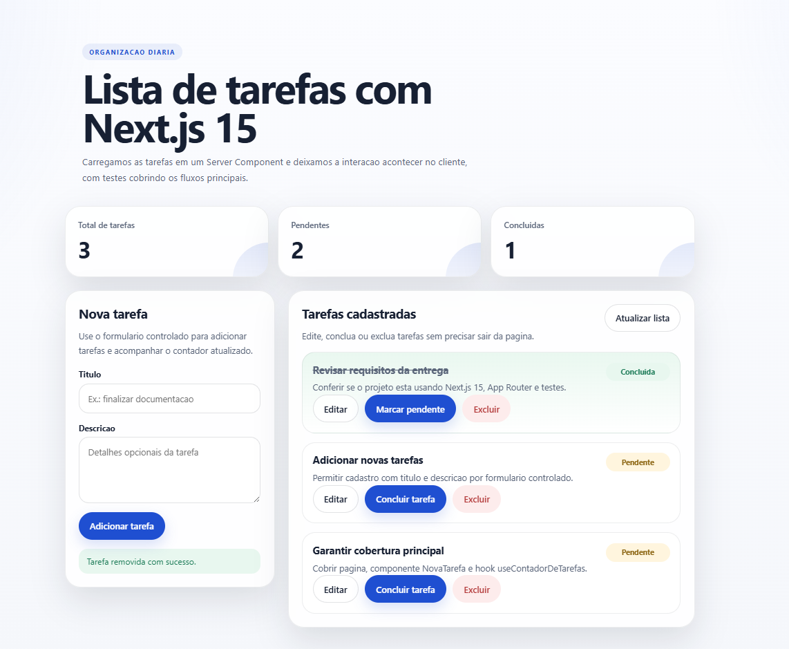

# Projeto de Portfólio - Lista de Tarefas com Next.js 15

Aplicação full stack simples, organizada e orientada a boas práticas para gerenciamento de tarefas. O projeto foi desenvolvido para estudo e portfólio, com interface web, API local, persistência em arquivo JSON e testes automatizados cobrindo os fluxos principais.

## Destaques do projeto

- Interface moderna para listar, criar, editar, concluir e excluir tarefas.
- API REST local para integração com navegador e Postman.
- Persistência em arquivo JSON para simular uma fonte de dados sem banco externo.
- Testes automatizados com Jest e Testing Library.
- Estrutura organizada com foco em legibilidade, manutenção e separação de responsabilidades.
- Projeto configurado com ESLint e Prettier.

## Preview da aplicação



> Dica: para o preview aparecer no GitHub, mantenha a captura de tela com o nome `preview.png` dentro da pasta `docs/`.

## Visão geral

A aplicação utiliza `Next.js 15` com `App Router` para combinar renderização no servidor, interface reativa no cliente e rotas de API no mesmo projeto. O sistema foi pensado para ser pequeno, mas bem estruturado, servindo como base de portfólio e como exemplo de arquitetura limpa para projetos front-end/full stack com TypeScript.

## Funcionalidades

- Listagem de tarefas carregadas pelo servidor.
- Adição de tarefas via formulário controlado.
- Edição de título e descrição.
- Marcação de tarefa como concluída ou pendente.
- Exclusão de tarefas.
- Sincronização da interface com a API.
- Consumo da API via Postman.
- Testes automatizados dos fluxos principais.

## Stack e tecnologias utilizadas

### Frameworks e bibliotecas principais

- `Next.js 15`: framework principal, responsável por páginas, layout, App Router e API routes.
- `React 19`: biblioteca de UI usada para construir a interface da aplicação.
- `TypeScript`: tipagem estática para aumentar segurança e manutenção do código.

### Linguagens e formatos usados no projeto

- `TSX`: usado nos componentes React tipados, como páginas, layout e componentes de interface.
- `TypeScript (.ts)`: usado em hooks, tipos e camada utilitária do projeto.
- `JavaScript (.js)`: usado em arquivos de configuração, como `jest.config.js`.
- `JSX`: a sintaxe JSX está presente dentro dos arquivos `.tsx`.
- `JSON`: usado para persistir tarefas em `data/tasks.json` e para a collection do Postman.
- `CSS`: usado na estilização global da aplicação em `app/globals.css`.

### Qualidade, testes e tooling

- `Jest`: framework de testes automatizados.
- `@testing-library/react`: testes focados em comportamento real da interface.
- `@testing-library/jest-dom`: matchers adicionais para DOM.
- `ESLint`: análise estática e padronização de qualidade.
- `Prettier`: formatação automática e padronizada do código.
- `Postman`: teste manual da API.
- `npm`: gerenciamento de dependências e scripts.

### Recursos nativos do Node.js utilizados

- `fs`: leitura e escrita do arquivo de tarefas.
- `path`: resolução de caminhos no sistema de arquivos.
- `crypto`: geração de identificadores únicos com `randomUUID()`.

## Arquitetura e organização de pastas

```text
app/
  api/
    tasks/
      route.ts
      [id]/route.ts
  globals.css
  layout.tsx
  page.tsx
components/
  NovaTarefa.tsx
  TaskBoard.tsx
hooks/
  useContadorDeTarefas.ts
lib/
  mockTasks.ts
  taskStore.ts
types/
  task.ts
data/
  tasks.json
postman/
  ListaDeTarefas.postman_collection.json
docs/
  preview.png
tests/
  app/
  components/
  hooks/
```

### Responsabilidade de cada pasta

- `app/`: páginas, layout global, estilos e rotas da API do Next.js.
- `components/`: componentes visuais e de interação da interface.
- `hooks/`: hooks customizados reutilizáveis.
- `lib/`: lógica de apoio e persistência de dados.
- `types/`: contratos e tipos compartilhados da aplicação.
- `data/`: armazenamento local das tarefas em JSON.
- `postman/`: collection pronta para testar a API.
- `docs/`: imagens e recursos usados na documentação do projeto.
- `tests/`: testes automatizados organizados por área.

## Conceitos de SOLID e Clean Code aplicados

O projeto foi organizado com foco em clareza e responsabilidade única.

- `Single Responsibility Principle`: cada arquivo resolve um problema específico.
  Exemplo: `NovaTarefa.tsx` cuida do formulário; `useContadorDeTarefas.ts` calcula o total; `taskStore.ts` centraliza a persistência.
- `Separação de responsabilidades`: interface, regras de dados, tipos e testes ficam em camadas distintas.
- `Baixo acoplamento`: os componentes trabalham sobre contratos simples (`Task`, `TaskInput`) e não sobre implementações espalhadas.
- `Legibilidade`: nomes explícitos, estrutura previsível e funções com responsabilidade clara.
- `Testabilidade`: a organização favorece testes unitários e facilita manutenção futura.

## Como rodar o projeto

### Pré-requisitos

- `Node.js 18+`
- `npm 9+`
- terminal aberto dentro da pasta do projeto

### Instalação

```bash
npm install
```

### Ambiente de desenvolvimento

Rode este comando em um terminal aberto na pasta do projeto:

```bash
npm run dev
```

Depois, abra no navegador a URL mostrada no terminal.

Observação importante:

- normalmente o projeto sobe em `http://localhost:3000`
- se a porta `3000` estiver ocupada, o Next pode subir em `http://localhost:3001`
- use exatamente a mesma porta no navegador e no Postman

### Build de produção local

```bash
npm run build
npm run start
```

## Como rodar os testes

### Rodar todos os testes uma vez

```bash
npm run test
```

Esse comando executa todos os testes uma única vez e mostra o resultado no terminal.

### Rodar testes automaticamente ao salvar

Abra um segundo terminal na mesma pasta do projeto e rode:

```bash
npm run test:watch
```

Esse comando deixa os testes em modo observação e reexecuta automaticamente sempre que você salva um arquivo.

### Gerar cobertura de testes

```bash
npm run test:coverage
```

## Fluxo recomendado no dia a dia

Use dois terminais ao mesmo tempo.

### Terminal 1

```bash
npm run dev
```

Responsável por subir a aplicação web e a API.

### Terminal 2

```bash
npm run test:watch
```

Responsável por rodar os testes automatizados enquanto você desenvolve.

Se quiser apenas validar tudo rapidamente, rode:

```bash
npm run test
```

## Qualidade de código

### ESLint

```bash
npm run lint
```

Usado para detectar inconsistências, padrões inadequados e problemas de qualidade.

### Prettier

```bash
npm run format
npm run format:check
```

Usado para manter o código formatado de forma consistente em todo o projeto.

## API local

Base URL:

```text
http://localhost:3000/api/tasks
```

Se o servidor subir em outra porta, substitua `3000` pela porta mostrada no terminal, por exemplo `3001`.

### Endpoints disponíveis

- `GET /api/tasks`: lista todas as tarefas.
- `POST /api/tasks`: cria uma nova tarefa.
- `GET /api/tasks/:id`: busca uma tarefa específica.
- `PUT /api/tasks/:id`: atualiza uma tarefa.
- `DELETE /api/tasks/:id`: remove uma tarefa.

### Exemplo de body JSON

```json
{
  "title": "Subir projeto no GitHub",
  "description": "Criar repositório, versionar e publicar no portfólio"
}
```

## Postman

O projeto inclui uma collection pronta para testes manuais:

- `postman/ListaDeTarefas.postman_collection.json`

Para usar corretamente:

- importe a collection no Postman
- ajuste `{{baseUrl}}` para a mesma porta exibida no terminal
- exemplo: `http://localhost:3001`

## Testes automatizados implementados

Os testes cobrem os fluxos centrais da aplicação:

- `tests/components/NovaTarefa.test.tsx`: renderização do formulário, validação e submissão.
- `tests/hooks/useContadorDeTarefas.test.tsx`: validação isolada do hook customizado.
- `tests/app/page.test.tsx`: renderização da página com dados locais.

## Estrutura limpa do projeto

- pastas geradas automaticamente, como `.next/` e `.swc/`, não fazem parte do código-fonte
- `node_modules/` também não deve ser versionada
- o projeto mantém apenas diretórios necessários para código, testes, dados e documentação da API

## Possíveis evoluções futuras

- integração com banco de dados real
- autenticação de usuários
- filtros por status
- busca e ordenação
- testes de integração da API
- testes end-to-end

## Autor

Projeto desenvolvido para estudo, prática de arquitetura front-end/full stack e composição de portfólio profissional com foco em `Next.js`, `TypeScript`, testes automatizados, organização de código e boas práticas de desenvolvimento.
